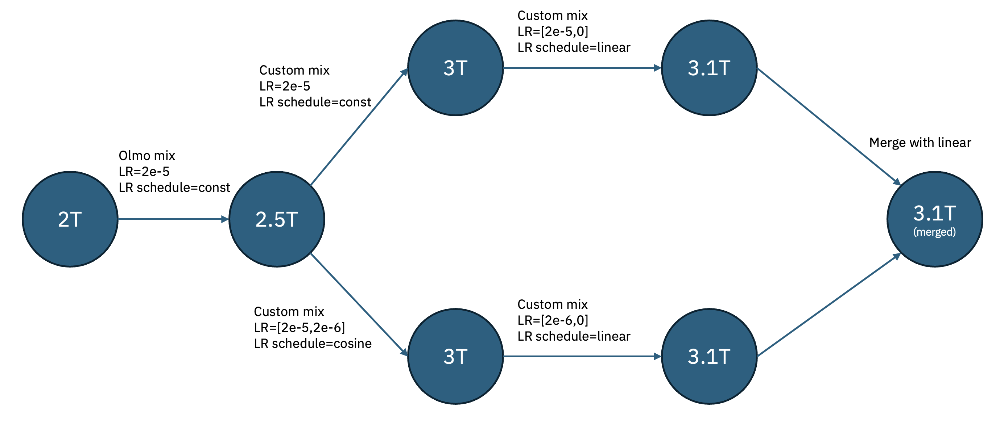

# Bamba9B - Fast and powerful!

During Christmas of 2024, IBM, Princeton, CMU, and UIUC [released](https://huggingface.co/blog/bamba) a performant Mamba2 based pretrained model with full data lineage trained to 2T tokens. Since then, we have been busy cooking an update with new datasets. Today, we are excited to release Bamba v2 trained for an additional 1T tokens that significantly improves on the previous checkpoint. The L1 and L2 leaderboard scores outperform Llama 3.1 8B, which was trained with nearly 5x the amount of data. All of this with the inference speedup that we get from Mamba2 based architecture, which with the latest vLLM is 2-2.5x faster than similar sized transformer models.

## Artifacts 📦
1. [Hugging Face Bamba collection](https://huggingface.co/collections/ibm-fms/bamba-674f1388b9bbc98b413c7bab) 
2. [GitHub repo with inference, training, and tuning scripts](https://github.com/foundation-model-stack/bamba)
3. [vLLM RFC](TODO)

## Fast and Powerful ⚡🏎️ 

> **Evaluation setup ⚙️ 🖥️:**
We rerun all the benchmarks following the setup and scripts [here](https://github.com/foundation-model-stack/bamba/blob/main/evaluation/README.md) for all models. For the v2 leaderboard results, we perform [normalization](https://huggingface.co/docs/leaderboards/open_llm_leaderboard/normalization) and report the normalized results. In all the evaluations, higher is better except where indicated.

While the HF leaderboards themselves are [not active](https://huggingface.co/spaces/open-llm-leaderboard/open_llm_leaderboard/discussions/1135) anymore since models evolve, comparing the key benchmarks is an important measure of model capabilities. We provide these comparisons below for various benchmarks. We observe that compared to other SoTA models that are trained to at least 10T+ tokens (and in many cases 15T+), Bamba 9B v2 outperforms the popular Llama 3.1 8B base model on both L1 and L2 averages.

#### HF OpenLLM v1 benchmarks \+ OpenbookQA, Boolq, and PIQA

| Model | Average | MMLU | ARC-C | GSM8K | Hellaswag | OpenbookQA | Piqa | TruthfulQA | Winogrande | Boolq |
| :---- | :---- | :---- | :---- | :---- | :---- | :---- | :---- | :---- | :---- | :---- |
| [Bamba 9B v2](https://huggingface.co/ibm-ai-platform/Bamba-9B) | 62.39 | 67.89 | 63.65 | 40.11 | **83.7** | **50.2** | 83.13 | 51.67 | 79.48 | 82.81 |
| [Nemotron-H 8B](https://huggingface.co/nvidia/Nemotron-H-8B-Base-8K) | 68.38 | 72.95 | 65.7 | 76.8 | 83.24 | 49.8 | **84.33** | 49.84 | **80.35** | **87.8** |
| [Meta Llama 3.1 8B](https://huggingface.co/meta-llama/Llama-3.1-8B) | 60.79 | 66.26 | 57.85 | 49.96 | 81.98 | 46.8 | 82.54 | 45.16 | 77.51 | 82.66 |
| [Olmo2 7B](https://huggingface.co/allenai/OLMo-2-1124-7B) | 63.99 | 63.96 | 64.51 | 68.01 | 81.93 | 49.2 | 81.39 | 43.32 | 770.3 | 84.77 |
| [IBM Granite v3 8B](https://huggingface.co/ibm-granite/granite-3.0-8b-base) | 64.25 | 64.13 | 63.74 | 60.2 | 83.34 | 47.2 | 83.08 | 51.35 | 79.79 | 87.22 |
| [Gemma2 9B](https://huggingface.co/google/gemma-2-9b) | 66.26 | 72.29 | **68.26** | 67.4 | 82.56 | 47.8 | 83.24 | 45.39 | 80.11 | 86.45 |
| [Qwen2.5 7B](https://huggingface.co/Qwen/Qwen2.5-7B) | **69.05** | **75.41** | 63.82 | **83.24** | 80.23 | 48.4 | 81.28 | **56.34** | 75.93 | 87.74 |

#### HF OpenLLM v2 benchmarks

| Model | Average | MMLU-PRO | BBH | GPQA | IFEval | MATH Lvl 5 | MuSR |
| :---- | :---- | :---- | :---- | :---- | :---- | :---- | :---- |
| [Bamba 9B](https://huggingface.co/ibm-ai-platform/Bamba-9B) | 14.86 | 25.07 | 23.51 | 8.17 | 18.76 | 6.57 | 7.09 |
| [Nemotron-H 8B](https://huggingface.co/nvidia/Nemotron-H-8B-Base-8K) | 23.98 | 36.02 | 32.91 | 10.96 | 25.15 | **23.56** | **15.3** |
| [Meta Llama 3.1 8B](https://huggingface.co/meta-llama/Llama-3.1-8B) | 14.45 | 25.46 | 25.16 | 8.61 | 12.55 | 6.19 | 8.72 |
| [Olmo2 7B](https://huggingface.co/allenai/OLMo-2-1124-7B) | 13.4 | 22.79 | 21.69 | 4.92 | 16.35 | 4.61 | 10.02 |
| [IBM Granite v3 8B](https://huggingface.co/ibm-granite/granite-3.0-8b-base) | 19.89 | 24.8 | 25.78 | 9.06 | **41.97** | 9.44 | 8.26 |
| [Gemma2 9B](https://huggingface.co/google/gemma-2-9b) | 21.79 | 34.84 | 34.81 | **11.07** | 21.28 | 13.44 | **15.3** |
| [Qwen2.5 7B](https://huggingface.co/Qwen/Qwen2.5-7B) | **25.83** | **37.62** | **35.62** | 9.96 | 34.77 | 22.43 | 14.6 |

## Training recipe 📖🍳 
Given the limited GPU budget (192 A100s), we did not have the option of training the model for 10T+ tokens. Instead, we decided to explore infusing the existing model with newer data as well as experimenting with techniques like model merging, which was highlighted in the [Olmo2 model training](https://allenai.org/blog/olmo2). Our training recipe is outlined in the below diagram.

<strong>Training receipe for Bamba 9B v2</strong>

We took the 2T base checkpoint (aka Bamba 9b v1) and extended it by adding [Olmo Mix](https://huggingface.co/datasets/allenai/olmo-mix-1124), released by AllenAI as part of Olmo2 training recipe. We use a constant learning rate schedule to go from 2T to 2.5T tokens, specifically `2e-5`. The precise data mix is in the below table.

| Dataset | Percentage |
| :---- | :----- |
| DCLM | 90.5 |
| ArXiV | 1.14 |
| Pes2o | 2.36 |
| Starcoder | 4.5 |
| Algebraic stack | 0.49 |
| Open web math | 0.51 |
| Wiki | 0.5 |

_Table 1:_ <strong> 2-2.5T Olmo2 mix data</strong>

We then used a mix of synthetic data from Nemotron-CC and Hugging Face datasets to continue training on 500B additional tokens, putting us at 3T tokens. During this phase, we launch two jobs, one with constant learning rate at 2e-5 and another with cosine learning rate going from 2e-5 ending at 2e-6. In our experiments, we observe that using these learning rate schedules improves different benchmarks. Our general observation is that cosine improves memorization benchmarks and constant improves knowledge. The data mixes for 2.5T to 3T are as follows.

| Dataset | Subdataset | Percentage |
| :---- | :----- | :---- |
| Nemotron-CC | CC | 70.5 |
| Nemotron-CC | Distill | 2.0 |
| Nemotron-CC | QA pairs | 5.0 |
| Nemotron-CC | Extract knowledge | 2.0 |
| Nemotron-CC | Knowledge list | 0.25 |
| Nemotron-CC | Wrap medium | 0.25 |
| SmolLM | CosmopediaV2 | 2.0 |
| SmolLM | Fineweb edu dedup | 3.0 |
| Finemath | Finemath 3+ | 3.0 |
| Finemath | Infiwebmath 3+ | 3.75 |
| Dolmino | Pes2o | 2.5 |
| Dolmino | Wiki | 0.5 |
| Olmo | Algebraic stack | 0.25 |
| Olmo | Starcoder | 5.0 |

_Table 2:_ <strong> 2.5-3T Custom mix data</strong>

Finally, we anneal both these models using very high quality data for 100B additional tokens and merge the final annealed models using [MergeKit](https://github.com/arcee-ai/mergekit). Specifically, we observe that simple weighted averaging works best for us. The resulting model is Bamba 9B v2! The data mix for annealing is below.

| Dataset | Subdataset | Percentage |
| :---- | :----- | :---- |
| Nemotron-CC | Distill | 7.0 |
| Nemotron-CC | QA pairs | 7.0 |
| Nemotron-CC | Extract knowledge | 7.0 |
| Nemotron-CC | Knowledge list | 2.0 |
| Nemotron-CC | Wrap medium | 2.0 |
| Dolmino | DCLM | 20.0 |
| Dolmino | FLAN | 17.0 |
| Dolmino | Pes2o | 5.9 |
| Dolmino | Wiki | 3.7 |
| Dolmino | StackXchange | 1.3 |
| SmolLM | CosmopediaV2 | 17.5 |
| Finemath | Finemath 4+ | 9.6 |

_Table 3:_ <strong> 3T-3.1T Custom mix data for annealing</strong>

> **Note on instruction tuning** 🧠🔧📘 
 We have experimented with [Tuluv3 data](https://huggingface.co/collections/allenai/tulu-3-datasets-673b8df14442393f7213f372) for creating an instruction following model leveraging [Open Instruct](https://github.com/allenai/open-instruct). We observe that the model's performance improves significantly across various benchmarks with a L1 average of 64.69 and an L2 average of 24.68. We are working on an instruction following model that has non-restricted data.

## vLLM integration 📥🧠📤 
We are deeply engaged with the vLLM community on adding support for Mamba2 attention. In our first release, we worked with various Mamba2 model developers to add support for tensor parallel support and reduce memory copies.

We are currently working on three major updates:
(a) **vLLM KV-cache management**: The allocation of pages and managing KV-cache is fundamentally different from that of transformer based models. We are working with the community toward achieving a generic solution that can handle any Hybrid model including Mamba2.
(b) **Chunked prefill**: We are well aware that chunked prefill can give tremendous improvements in real workloads. While the current kernel works well for transformer based models, we need to implement a new kernel for Mamba2 based models.
(c) **Faster decode kernels**: We are working on Triton implementation of the Conv1D kernel to ensure that the model can run in a performant manner on AMD GPUs as well. Further, we are exploring the fusion of the 4-5 kernels at decode time to reduce the latency of token generation even further.

We anticipate that with the above changes, we can achieve a first class citizen support for Mamba2 based models and significantly better performance than what is today (2-2.5x for longer sequence lengths/larger batches).

## Call for Action 📢👉🚀
We are committed to keeping open datasets with complete reproduction of our results. We call on the community to help improve the model on multiple fronts:
1. Test time scaling and GRPO on the model
2. Improve inference performance in vLLM (we expect 4-5x better than corresponding transformer models)
3. Help us improve MATH skills!